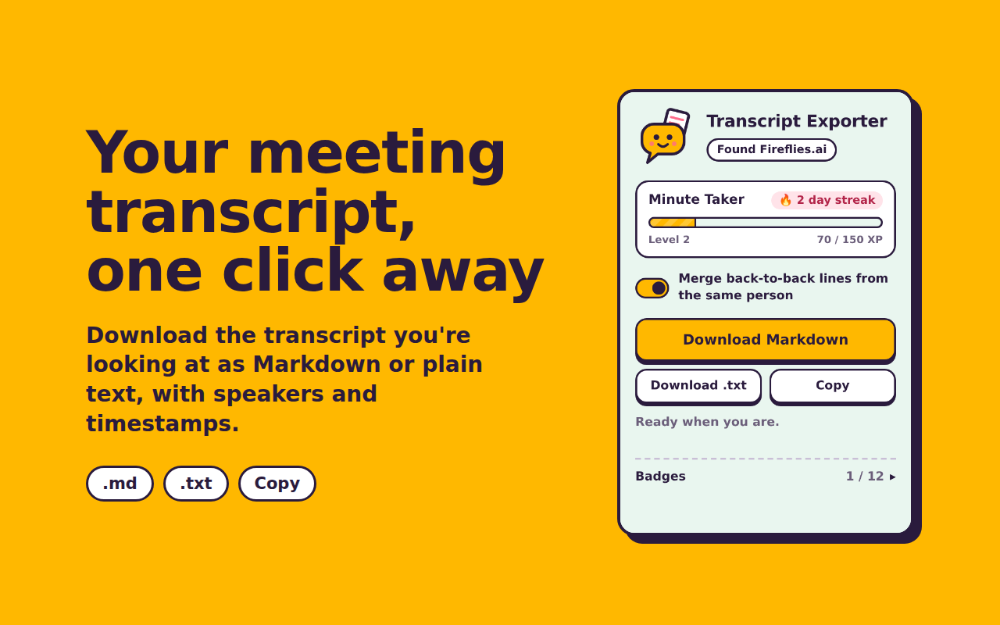
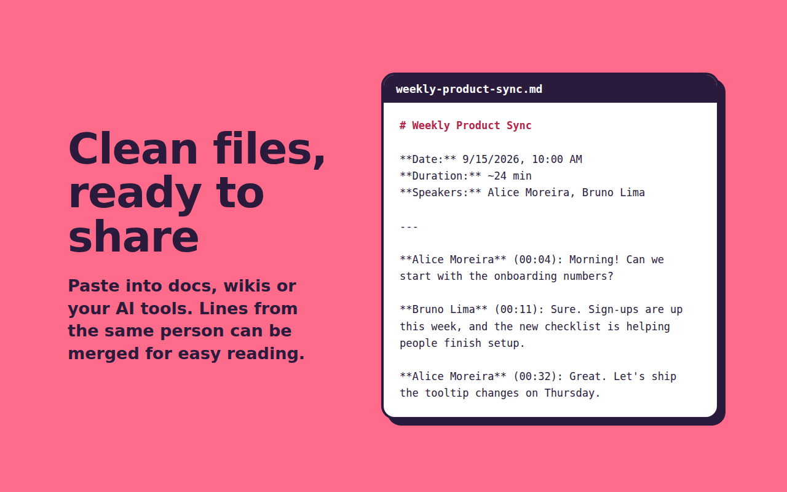
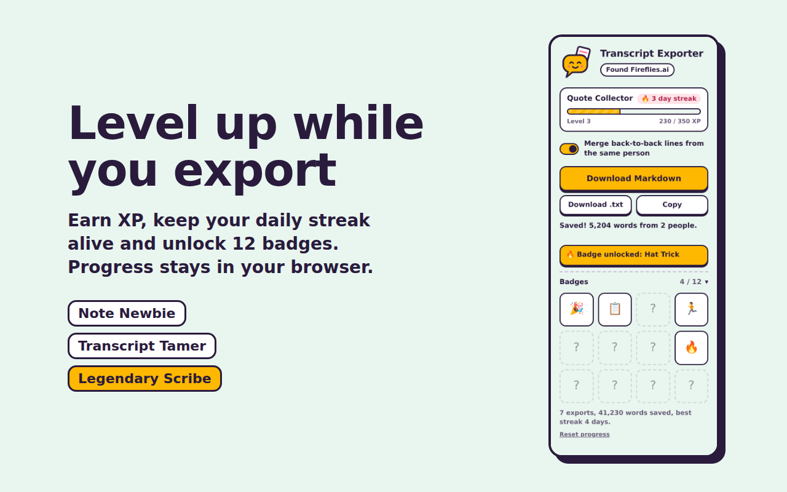

<p align="center">
  
</p>

<h1 align="center">Meeting Transcript Exporter</h1>

<p align="center">
  Export the meeting transcript you're looking at to <b>Markdown</b> or <b>plain text</b>, in one click.<br>
  No AI, no account, no servers. And you level up while you do it.
</p>

<p align="center">
  
  
  
  
</p>

<p align="center">
  
</p>

## Why

Transcription apps show you the whole transcript in the browser, but getting it out as a file is often limited or locked behind a plan. This extension reads the transcript already rendered on the page and saves it as a clean file you can paste into docs, wikis or AI tools.

Everything runs locally, so it's fast and your conversations never leave your machine.

## Features

- 📄 **Markdown, .txt or clipboard**, with speaker names and timestamps
- 🧾 **Header with the essentials**: title, date, duration and participants
- 🔗 **Merge back-to-back lines** from the same person for easier reading
- 📜 **Long meetings supported**: scrolls through transcripts that only render visible lines
- 🎮 **XP, levels, streaks and 12 badges**, just for fun
- 🔒 **Private by design**: no analytics, no network requests, runs only when you click it
- 🧩 **Adapter system**: support a new app by adding one file

## Supported apps

| App | Status |
|---|---|
| Fireflies.ai | ✅ Supported |
| Your favorite app | 🙋 [Request it](../../issues/new?template=adapter_request.yml) or [build it](CONTRIBUTING.md) |

## Install

### From the Chrome Web Store
_Coming soon._

### From source
1. [Download the latest release](../../releases/latest) or clone this repo.
2. Open `chrome://extensions` (or `brave://extensions`, `edge://extensions`).
3. Turn on **Developer mode**.
4. Click **Load unpacked** and select the project folder.
5. Pin the extension to your toolbar.

Works in Chrome, Brave, Edge, Arc and other Chromium-based browsers.

## Usage

1. Open a meeting in a supported app, with the transcript visible.
2. Click the extension icon.
3. Choose **Download Markdown**, **Download .txt** or **Copy**.

<p align="center">
  
</p>

### Example output

```markdown
# Weekly Product Sync

**Date:** 9/15/2026, 10:00 AM
**Duration:** ~24 min
**Speakers:** Alice Moreira, Bruno Lima
**Source:** Fireflies.ai

---

**Alice Moreira** (00:04): Morning! Can we start with the onboarding numbers?

**Bruno Lima** (00:11): Sure. Sign-ups are up this week, and the new checklist is helping people finish setup.
```

## Levels and badges

<p align="center">
  
</p>

Every export earns XP:

| Action | XP |
|---|---|
| Export a transcript | 10 |
| Every 100 words (max 20) | +1 |
| A meeting you haven't exported before | +5 |
| Keeping a daily streak going | +5 |
| Unlocking a badge | +25 |

Climb from **Note Newbie** to **Legendary Scribe** and collect badges like 🦉 Night Owl, 🏃 Marathon Meeting and 🎯 Triple Threat. Hover a locked badge to see how to unlock it.

Progress is stored only in your browser with `chrome.storage.local`, and you can reset it from the Badges section.

## How it works

```
popup.js ──inject──▶ src/core.js + src/adapters/*.js ──▶ adapter reads the page
    ▲                                                          │
    └──────────── { title, meta, paragraphs } ◀────────────────┘
    │
    └─▶ format as .md / .txt ─▶ download or copy ─▶ game.js awards XP
```

| File | Role |
|---|---|
| `manifest.json` | Extension config and permissions |
| `popup.html`, `popup.css` | Popup UI and mascot |
| `popup.js` | Injects adapters, formats and downloads the transcript |
| `game.js` | XP, levels, streaks and badges |
| `src/core.js` | Shared helpers and adapter registry |
| `src/adapters/` | One file per supported app |

### Permissions

| Permission | Why |
|---|---|
| `activeTab` | Read the tab you're on, only after you click the extension |
| `scripting` | Run the bundled adapter on that tab |
| `storage` | Remember your XP and badges locally |

No host permissions, no remote code. See [PRIVACY.md](PRIVACY.md).

## Contributing

The most useful contribution is an adapter for a new transcription app. It's one file, and [CONTRIBUTING.md](CONTRIBUTING.md) walks you through it, including how to pick selectors that don't break on every deploy.

Bug reports and ideas are welcome in [Issues](../../issues).

## Limitations

Adapters depend on each app's page structure. When an app updates its interface, its adapter may stop working until the selectors are updated. If that happens, please [open an issue](../../issues/new?template=bug_report.yml).

## Disclaimer

This is an independent open-source project. It is not affiliated with, endorsed by, or sponsored by Fireflies.ai or any other app it supports. Product names and trademarks belong to their owners and are used only to describe compatibility.

Use it for meetings you have legitimate access to. You're responsible for following the terms of the apps you use and any applicable laws and policies on recorded conversations.

## License

[MIT](LICENSE) © 2026 Kenny Afonso
